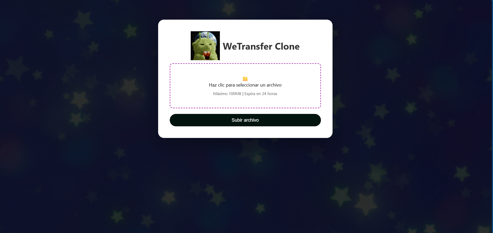

 ## Equipo LCK

- Rosa Lizbeth Barcenas Mancilla
- Alberto Daiji Montes Kato  
- Cristian Yahir Garcia Hernandez

 # Westransfer

 ## Servicio Web de Transferencia de Archivos

## Objetivo
Desarrollar una aplicación web tipo servicio de transferencia de archivos, inspirada en WeTransfer, utilizando **Python** o **Go**, implementando una arquitectura con base de datos principal en **PostgreSQL** y una base de datos secundaria en **Supabase**.

---

## Descripción
Se desarrollará un sistema que permita:

- Subir archivos desde el cliente.
- Generar enlaces de descarga únicos.
- Gestionar la expiración de archivos.

El sistema deberá implementar una arquitectura distribuida o híbrida donde:

- **PostgreSQL**→ Base de datos principal.
- **Supabase** → Respaldo, sincronización o almacenamiento complementario .

---

## Requerimientos Funcionales

### Subida de archivos
- Permitir cargar archivos desde el cliente.
- Validar tamaño y tipo de archivo.
- Guardar archivos en servidor o almacenamiento definido.

### Generación de enlace único
- Crear un token/hash único.
- Asociarlo a los archivos cargados.

### Descarga de archivos
- Endpoint para descargar mediante enlace.
- Validación de existencia y expiración.

### Expiración automática
- Los archivos se eliminan después de cierto tiempo.
- Implementar job o proceso automático para limpieza.

---

## Arquitectura de Datos (OBLIGATORIO)

### Base de datos principal: PostgreSQL
Debe almacenar:
- Información de archivos
- Tokens de descarga
- Fechas de expiración
- Estado del archivo

### Base secundaria: Supabase
Debe usarse al menos para uno de los siguientes:
- Respaldo de metadata
- Logs de actividad (subidas, descargas)
- Almacenamiento de archivos (Supabase Storage)

> La autenticación es opcional, pero se debe justificar el uso de Supabase en la arquitectura.

---

## API 

Endpoints mínimos:
- `POST /upload` → Subida de archivos
- `GET /download/{token}` → Descargar archivo por token
- `GET /file/{token}` → Obtener información del archivo
- `DELETE /file/{token}` (opcional) → Eliminar archivo

---

## Requerimientos de Seguridad

- Validación de archivos por MIME/type.
- Protección contra:
  - Path traversal
  - Subida de scripts ejecutables
- Tokens seguros (UUID o hash)
- Límite de tamaño por request
- Manejo de errores controlado

## Para la base de datos se instalo PostgreSQL

## En supabase tambien realizamos la base de datos para la copia de seguridad

## Page

